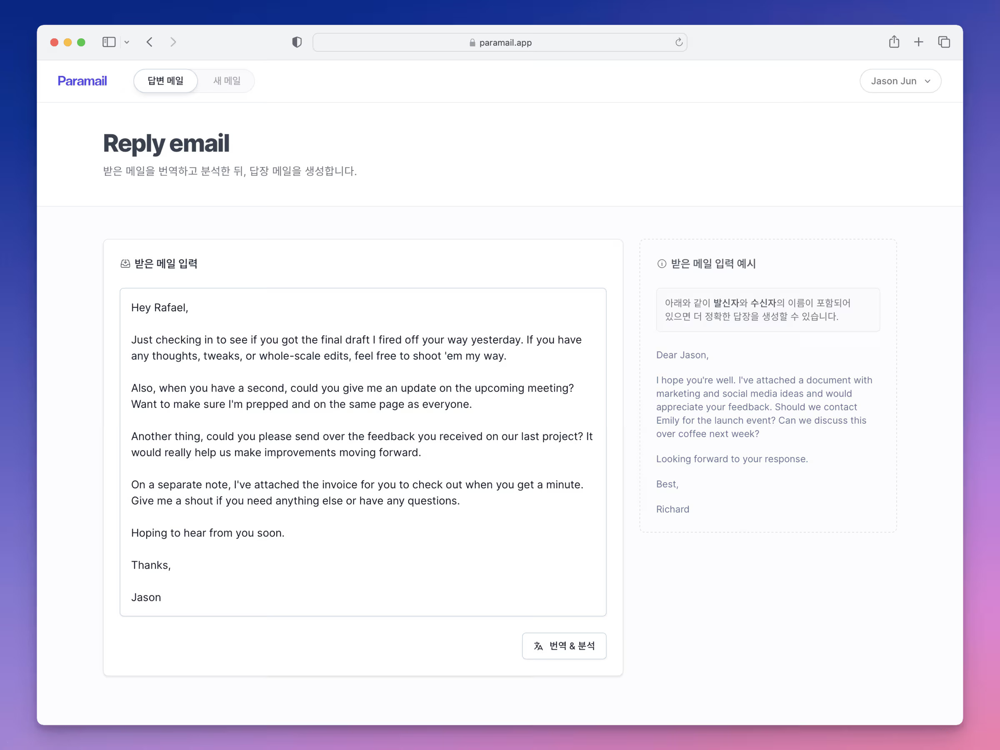

# Paramail

Paramail is an AI-powered email assistant that helps users understand and respond to emails in foreign languages. It analyzes incoming emails, provides summaries, suggests action items, and generates appropriate responses - all with seamless language translation support.



## Features

- **Email Analysis**: Automatically summarizes emails and extracts key action items
- **Smart Responses**: Generates contextually appropriate email replies
- **Multi-language Support**: Seamlessly handles communication across language barriers
- **User-friendly Interface**: Clean, intuitive design for effortless email management

## Tech Stack

- **Frontend**: Next.js, React, Tailwind CSS
- **Backend**: Next.js API Routes
- **Database**: Supabase
- **AI/ML**: OpenAI API
- **Translation**: Google Translate API
- **Payments**: Stripe integration
- **Authentication**: Supabase Auth with Google & Facebook providers

## Getting Started

### Prerequisites

- Node.js 16.x or higher
- npm or yarn
- Supabase account
- OpenAI API key
- Google Cloud API key (for translation)
- Stripe account (for payment processing)

### Installation

1. Clone the repository:

   ```bash
   git clone https://github.com/htjun/paramail.git
   cd paramail
   ```

2. Install dependencies:

   ```bash
   npm install
   # or
   yarn install
   ```

3. Set up environment variables:

   - Copy `.env.example` to `.env`
   - Fill in all required API keys and configuration values

4. Start the development server:

   ```bash
   npm run dev
   # or
   yarn dev
   ```

5. Open [http://localhost:3000](http://localhost:3000) in your browser

## Available Scripts

- `npm run dev`: Starts the development server
- `npm run build`: Builds the app for production
- `npm run start`: Runs the built app in production mode
- `npm run lint`: Lints the code using ESLint
- `npm run prettier`: Checks the code formatting using Prettier
- `npm run prettier:fix`: Fixes the code formatting using Prettier

## Environment Variables

The following environment variables are required:

```env
# Application
SITE_URL=
NEXT_PUBLIC_BASE_URL=
API_ROUTE_SECRET=

# OpenAI
OPENAI_API_KEY=

# Google Translate
GOOGLE_API_KEY=

# Authentication
GOOGLE_CLIENT_ID=
GOOGLE_CLIENT_SECRET=
FACEBOOK_CLIENT_ID=
FACEBOOK_CLIENT_SECRET=

# Supabase
NEXT_PUBLIC_SUPABASE_URL=
NEXT_PUBLIC_SUPABASE_ANON_KEY=
SUPABASE_SERVICE_KEY=

# Stripe
NEXT_PUBLIC_STRIPE_KEY=
STRIPE_SECRET_KEY=
STRIPE_SIGNING_SECRET=
```

See `.env.example` for a complete list of required variables.

## License

This project is not yet licensed. Please contact the author for usage permissions.

## Contact

For questions or feedback, please open an issue on GitHub.
